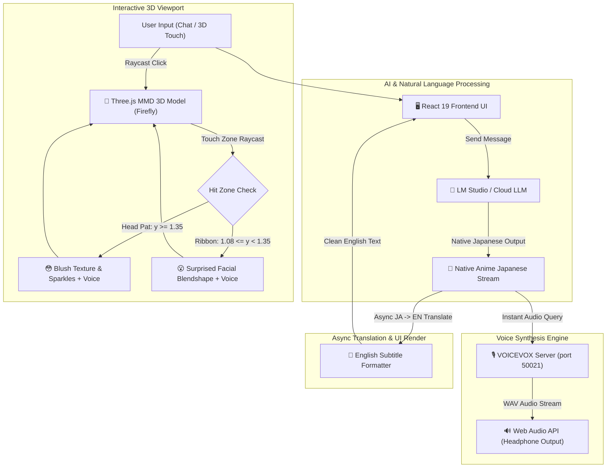
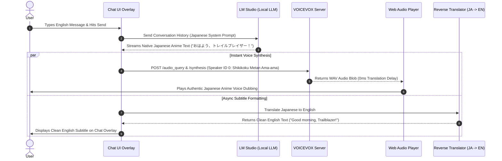
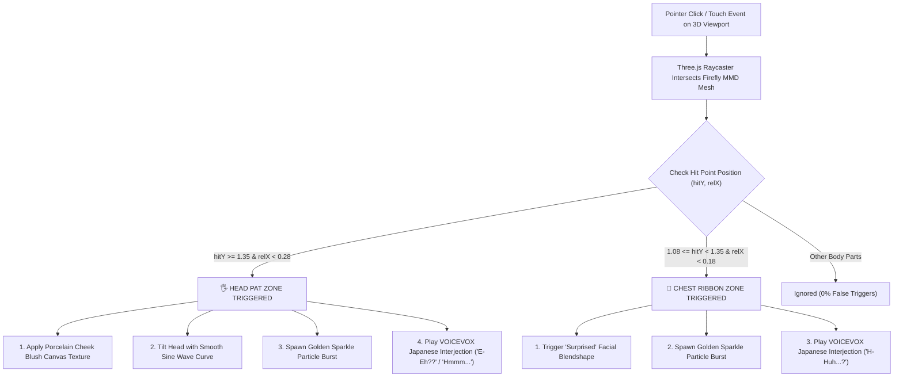

# Viera — System Architecture & Workflow Guide

This document outlines the system architecture, data flow pipelines, and interactive workflows of **Viera**, making it easy for reviewers and developers to understand how the 3D graphics, local AI, and voice synthesis modules interact.

---

## 1. High-Level Architecture Overview

---

## 2. Core Workflows

### Workflow 1: Dual-Language Chat & Voice Synthesis Pipeline

---

### Workflow 2: 3D Raycasting Touch & Head Pat Interaction

---

## 3. Component Interaction Matrix

| Component | Responsibility | Key File |
| :--- | :--- | :--- |
| **`App.tsx`** | Central state orchestrator, chat state management, and stream handling. | [`src/App.tsx`](file:///home/nescryo/Projects/Viera/src/App.tsx) |
| **`Scene.tsx`** | Three.js 3D canvas viewport, MMD model loader, blush textures, and Raycasting touch handlers. | [`src/components/3d/Scene.tsx`](file:///home/nescryo/Projects/Viera/src/components/3d/Scene.tsx) |
| **`ttsService.ts`** | VOICEVOX API integration, audio query modulation, and reverse translation bridge. | [`src/services/ttsService.ts`](file:///home/nescryo/Projects/Viera/src/services/ttsService.ts) |
| **`SettingsModal.tsx`** | User configuration for AI providers, VOICEVOX character selection, and server URLs. | [`src/components/ui/SettingsModal.tsx`](file:///home/nescryo/Projects/Viera/src/components/ui/SettingsModal.tsx) |
| **`personas.ts`** | Firefly character definitions, system prompts, and native anime Japanese roleplay rules. | [`src/data/personas.ts`](file:///home/nescryo/Projects/Viera/src/data/personas.ts) |

---

## Summary for Reviewers

Viera operates on a **Dual-Channel Processing Model**:
- **Audio Channel**: Direct native Japanese streaming from LLM to local VOICEVOX engine for 0ms voice synthesis latency.
- **Visual UI Channel**: Clean English subtitle formatting and 60 FPS Three.js 3D touch interactions for a rich, responsive anime companion experience.
