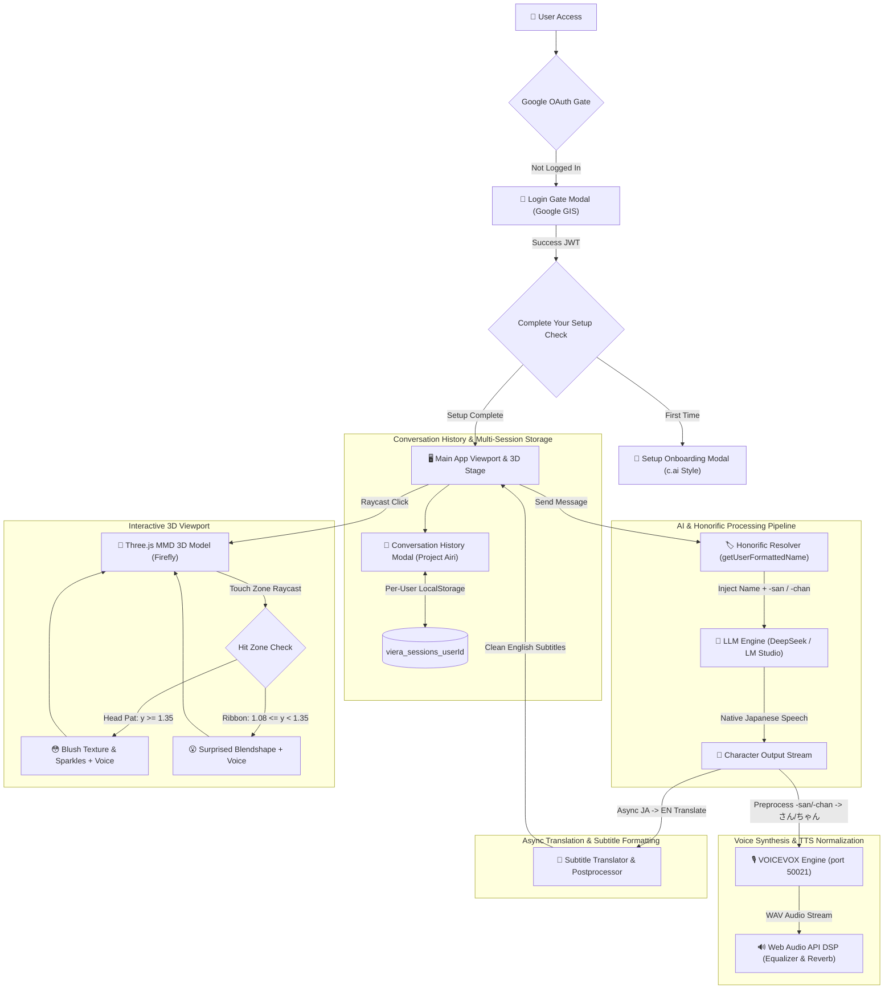
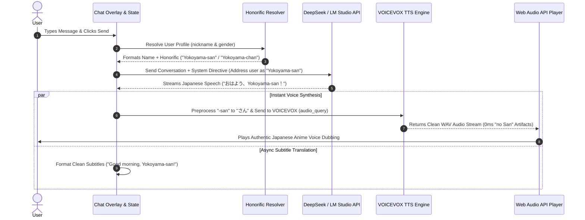
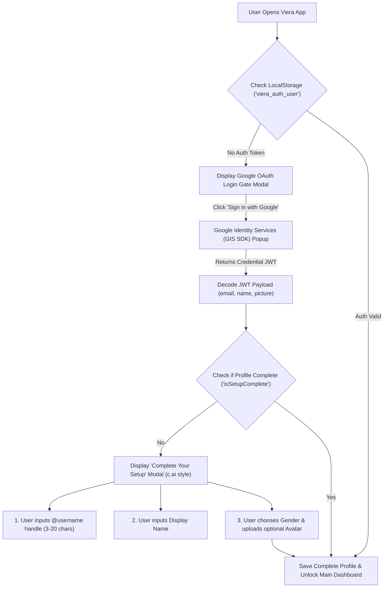
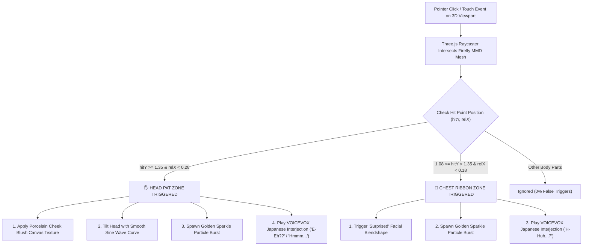

# Viera — System Architecture & Workflow Guide

This document outlines the system architecture, data flow pipelines, authentication gates, and interactive workflows of **Viera**, making it easy for reviewers and developers to understand how the 3D graphics, local/cloud AI, voice synthesis modules, and user profile honorific systems interact.

---

## 1. High-Level Architecture Overview

---

## 2. Core Workflows

### Workflow 1: Dynamic User Name & Honorific Dubbing Pipeline

---

### Workflow 2: Google OAuth 2.0 Auth Gate & Onboarding Setup

---

### Workflow 3: 3D Raycasting Touch & Head Pat Interaction

---

## 3. Component Interaction Matrix

| Component | Responsibility | Key File |
| :--- | :--- | :--- |
| **`App.tsx`** | Central state orchestrator, auth session gate, history sync, and stream handling. | [`src/App.tsx`](src/App.tsx) |
| **`authService.ts`** | Google OAuth GIS SDK payload decoding and LocalStorage auth session persistence. | [`src/services/authService.ts`](src/services/authService.ts) |
| **`historyService.ts`** | Scoped multi-session CRUD in LocalStorage per user, auto-titling, and active session tracking. | [`src/services/historyService.ts`](src/services/historyService.ts) |
| **`aiService.ts`** | LLM API streaming, dynamic user honorific resolution (`getUserFormattedName`), and system directives. | [`src/services/aiService.ts`](src/services/aiService.ts) |
| **`ttsService.ts`** | VOICEVOX API integration, Hiragana honorific pre-processing (`-san` $\rightarrow$ `さん`), and Web Audio DSP. | [`src/services/ttsService.ts`](src/services/ttsService.ts) |
| **`SetupOnboardingModal.tsx`** | Onboarding profile setup modal with c.ai floating input groups and custom glass gender dropdown. | [`src/components/ui/SetupOnboardingModal.tsx`](src/components/ui/SetupOnboardingModal.tsx) |
| **`ConversationHistoryModal.tsx`** | Project Airi concept multi-session history modal with top `+ New` button and inline rename. | [`src/components/ui/ConversationHistoryModal.tsx`](src/components/ui/ConversationHistoryModal.tsx) |
| **`UserProfileModal.tsx`** | c.ai style profile view/edit modal with avatar upload, gender selector, and clean empty bio state. | [`src/components/ui/UserProfileModal.tsx`](src/components/ui/UserProfileModal.tsx) |
| **`Scene.tsx`** | Three.js 3D canvas viewport, MMD model loader, blush textures, and Raycasting touch handlers. | [`src/components/3d/Scene.tsx`](src/components/3d/Scene.tsx) |

---

## Summary for Reviewers

Viera operates on a **Multi-Layered Interactive Architecture**:
- **Authentication & Onboarding Gate**: Ensures secure Google OAuth login and personalized user setup before accessing Viera.
- **Dynamic Honorific Address Layer**: Automatically addresses the user by their Display Name with gender-aware Japanese honorifics (`-san` / `-chan`).
- **Dual-Channel Processing Model**: Instant VOICEVOX Japanese speech synthesis + clean English subtitle formatting and 60 FPS Three.js 3D touch interactions.
